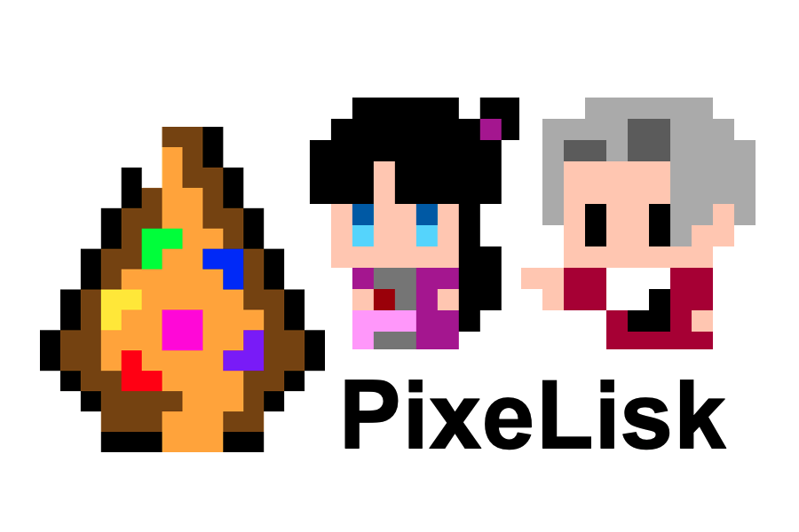

# PixeLisk



Ever wanted to design your own pixel-art NTF while watching it appreciate in value through votes by the online community? Join PixeLisk - a blockchain-powered evaluation system for pixel art lovers! 

PixeLisk is submitted to HackOnLisk 2021.

[Look at PixeLisk on Devpost!](https://devpost.com/software/pixelisk)
[Watch a Demo on YouTube!](https://www.youtube.com/watch?v=rodgqOm8SXI)

PixeLisk is a blockchain plaform where anyone can design and create a pixel artwork. Each pixel artwork is tagged to a non-fungible token (NTF). PixeLisk has a unique feature, which is that it allows the community to participate in judging and evaluating the value of the pixel artworks (called a "Pix") submitted.

The three main features of PixeLisk are:

1. *Pix Creator*: allows pixel artists to create a 16x16 Pix for 5 Lisks. The in-app pixel art editor and the start cost help maintain a high-quality pixel art community

2. *Pix Gallery*: showcases a user’s most prized Pixs. Creators are forever immortalised in the history of a Pix, while owners can brag about them on their walls. The Pix Gallery also includes a trophy cabinet and shows the user's asset/net worth.


3. *_The Collector_*: the unique feature of PixeLisk. After the creation of a Pix, the creator can transfer it to _The Collector_, a public address that allows artworks to be voted and evaluated. _The Collector_ acts as an evaluation system for the artworks based on how much it appeals to the community. The creator of the artwork can claim back the Pix at any time. This feature enables sponsors, art critics and participants to appreciate the ingenuity of the artists by voting for their Pixes, which increases the value of the particular artwork.

### _The Collector_'s (Public) Address
lskwwmtg88fyv7sg52t2r45sm7p4r8guk5wwq8bb5

### Installation
To install and run PixeLisk, for each of the three apps _blockchain\_app_, _db\_app_ and _frontend\_app_, run the following:

```shell
$ npm install
$ npm start
```

### Credits

- Aleks Popovic: I followed [his blog](https://aleksandarpopovic.com/How-to-build-a-Pixel-Art-Drawing-App-in-React/) to create the pixel art drawing editor portion of the front-end application
- react-colors (MIT)
- react-component-export-image (MIT)

### Sample Pix?

Maya                       |  Edgeworth
:-------------------------:|:-------------------------:
  |  